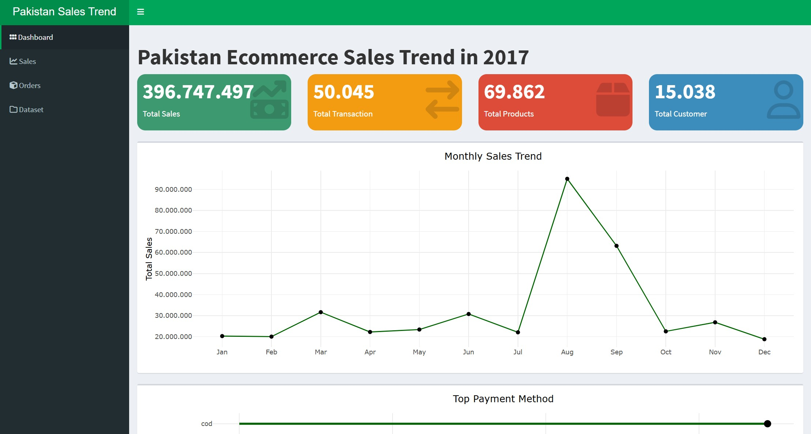

# 📊 Pakistan E-commerce Sales Analytics Dashboard  

An interactive data visualization dashboard that uncovers **Pakistan’s 2017 e-commerce sales trends, customer behavior, and payment patterns**, built using **R and Shiny**.  

---

## 🚀 Overview  
The Pakistan E-Commerce Trends Dashboard is an interactive data visualization project developed for the **Data Visualization Capstone** at **Algoritma Academy**.  
The main goal was to design and develop an interactive dashboard using **R and Shiny**, delivering **clear data storytelling**, **visual clarity**, and **actionable business insights** through engaging analytics.  

The dashboard provides insights into:  
- 📈 **Overall Sales Performance** → Track total transactions, revenue, and customer metrics.  
- 📅 **Monthly Sales Trends** → Identify peak and low-performing months throughout 2017.  
- 🏆 **Top Products & Categories** → Discover which product groups drive the most sales.  
- 💳 **Customer Payment Preferences** → Understand which payment methods dominate the market.  
- 💰 **Price vs. Demand Relationship** → Explore how product pricing influences sales volume.  

It emphasizes **clarity, interactivity, and storytelling** to support **data-driven business decisions**.  

---

## 🎥 Live Demo  
🔗 https://zahranuranisah.shinyapps.io/Pakistan_Ecommerce_Sales_Dashboard/

---

## 💡 Why This Matters  
This dashboard transforms raw e-commerce data from Pakistan (2017) into **clear, actionable insights** about customer behavior, product trends, and payment preferences.  
By visualizing transaction data, it helps identify which categories and discount strategies drive performance — providing **practical takeaways** for business and policy decisions in emerging markets.  

Beyond this specific case, it demonstrates how **data visualization and dashboard design** can turn large, complex datasets into interactive insights — a **critical skill for data-driven decision-making** across industries.  

---

## 💼 Business Questions Answered  
- Which product categories and payment methods contributed most to total sales performance in 2017?  
- How did monthly sales trends change throughout the year, and what periods showed peak activity?  
- How does product pricing relate to customer demand? Do lower prices drive higher sales volume?  

---
## 📈 Key Insights  
- **Top Performing Category & Payment Preference**  
  - *Mobiles & Tablets* lead as the top-selling category by total sales, highlighting strong consumer demand for electronics.  
  - *Cash on Delivery (COD)* dominates as the preferred payment method, accounting for **34,000+ orders**, showing reliance on COD in Pakistan’s e-commerce landscape.  

- **Monthly Sales Pattern**  
  - Sales peaked sharply in **August**, possibly due to seasonal events or promotional campaigns driving higher consumer activity.  
  - This insight helps businesses plan marketing campaigns or restock high-demand products before similar peak months.  

- **Price–Quantity Relationship**  
  - A clear inverse relationship exists between price and quantity sold — higher-priced items sell in smaller quantities, while lower-priced products drive higher volume.  
  - This finding helps guide **pricing strategies and inventory management** for competitive yet profitable operations.  

---

## 🧱 Project Workflow  
1. **Virtual Environment Setup**  
   - Preparation of R environment and required libraries.  
2. **Data Preprocessing**  
   - Data Cleaning  
   - Data Wrangling and Aggregation  
   - Handling missing values and date conversions  
3. **Data Visualization**  
   - Exploratory visualizations using ggplot2  
   - Interactive filtering and tooltips with plotly  
4. **Dashboard Development**  
   - Interactive UI using Shiny  
   - Theming and layout design for better readability and storytelling  

---

## 📂 Dataset Summary  
The dataset covers Pakistan’s e-commerce transactions for the year **2017**.  
It includes detailed information about products, pricing, discounts, quantities, payment methods, and shipping status.  

| Variable | Description |
|-----------|-------------|
| `item_id` | Unique ID of each sold product |
| `date_created` | Date when the transaction occurred |
| `product_name` | Name of the sold product |
| `product_category` | Product category |
| `price` | Unit price |
| `quantity_ordered` | Number of units purchased |
| `grand_total_price` | Total amount after discount |
| `discount_amount` | Discount value applied |
| `shipping_status` | Product shipping status |
| `payment_method` | Payment method used |

---

## 🧠 Technical Stack  
- **Language:** R  
- **Framework:** Shiny  
- **Libraries:** ggplot2, dplyr, plotly, shinythemes, flexdashboard  
- **IDE:** RStudio  

---

## 👩🏻‍💻 Author  
**Zahra Nur Anisah** – Data Science Enthusiast  
Passionate about transforming raw data into meaningful business insights through analytics and visualization.  

📧 **Email:** [zahranuranisah@gmail.com](mailto:zahranuranisah@gmail.com)  
💼 **LinkedIn:** [linkedin.com/in/zahranuranisah](https://www.linkedin.com/in/zahranuranisah)  

